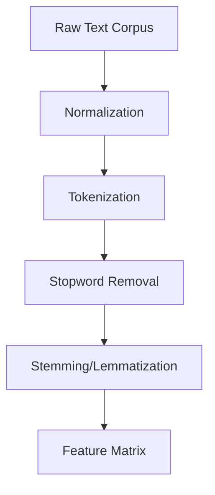

# NLP Conversational AI


---

## Overview

**NLP Conversational AI** is a comprehensive repository for learning and experimenting with Natural Language Processing (NLP) techniques, focusing on building conversational AI systems. The repository includes well-documented Jupyter notebooks, code samples, and datasets covering a wide range of NLP topics, from basic preprocessing to advanced feature engineering and model building.

---

## Features

- 📚 **Educational Notebooks:** Step-by-step lab sessions and tutorials on NumPy, Pandas, text preprocessing, feature extraction, and more.
- 🧠 **Conversational AI Focus:** Practical examples and code for building conversational agents.
- 🔬 **Data Science Workflows:** End-to-end workflows for data loading, cleaning, feature engineering, and model evaluation.
- 🛠️ **Hands-on Exercises:** Interactive code cells and exercises for self-practice.
- 📊 **Visualization:** Integrated visualizations to aid understanding of data and algorithms.

---

## Repository Structure

```
nlp-conversational-ai/
│
├── notebooks/
│   ├── Lab Session I Introduction to NumPy Part 1.ipynb
│   ├── Lab Session I Introduction to NumPy Part 2.ipynb
│   ├── Introduction to Pandas.ipynb
│   ├── Textual Data Preprocessing.ipynb
│   ├── Preprocessed Corpus Feature Matrix.ipynb
│   ├── Handling Missing Values.ipynb
│   ├── Outlier Analysis.ipynb
│   ├── Linear Regression LSE.ipynb
│   ├── Decision Tree ID3.ipynb
│   └── Feature Selection.ipynb
│
├── LICENSE
└── README.md
```

---

## Quick Start

### 1. Clone the Repository

```bash
git clone https://github.com/yourusername/nlp-conversational-ai.git
cd nlp-conversational-ai
```

### 2. Install Requirements

Most notebooks require Python 3.7+ and the following libraries:

- numpy
- pandas
- matplotlib
- scikit-learn
- nltk
- seaborn
- missingno
- plotly

Install them using pip:

```bash
pip install numpy pandas matplotlib scikit-learn nltk seaborn missingno plotly
```

### 3. Download Datasets

Some notebooks expect datasets in specific paths (e.g., `C:/Machine Learning/ML_Datasets/`). Update the paths in the notebooks or place the datasets accordingly.

### 4. Run the Notebooks

Open JupyterLab or Jupyter Notebook:

```bash
jupyter lab
```

Navigate to the `notebooks/` directory and start exploring!

---

## Visual Guide

### Example: NumPy Array Creation

```python
import numpy as np
a = np.arange(10)
print(a)
```


### Example: Text Preprocessing Workflow



---

## Learning Path

1. **NumPy & Pandas:** Start with the basics of numerical and tabular data manipulation.
2. **Text Preprocessing:** Learn how to clean and prepare text data for NLP tasks.
3. **Feature Engineering:** Explore methods to convert text into numerical features (TDM, TF-IDF, etc.).
4. **Modeling:** Apply machine learning models for classification, regression, and conversational AI.
5. **Advanced Topics:** Outlier analysis, feature selection, and more.

---

## License

This project is licensed under the [MIT License](LICENSE).

---

## Acknowledgements

- Inspired by academic NLP courses and open-source data science communities.
- Uses datasets and libraries from the Python scientific ecosystem.

---

## Contributing

Contributions, issues, and feature requests are welcome! Feel free to fork the repository and submit pull requests.

---

## Contact

For questions or feedback, please open an issue or contact the maintainer.

---